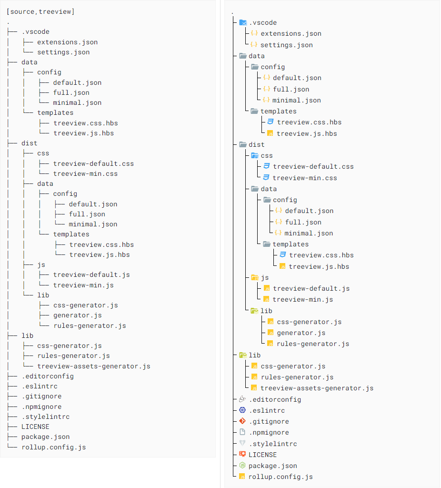
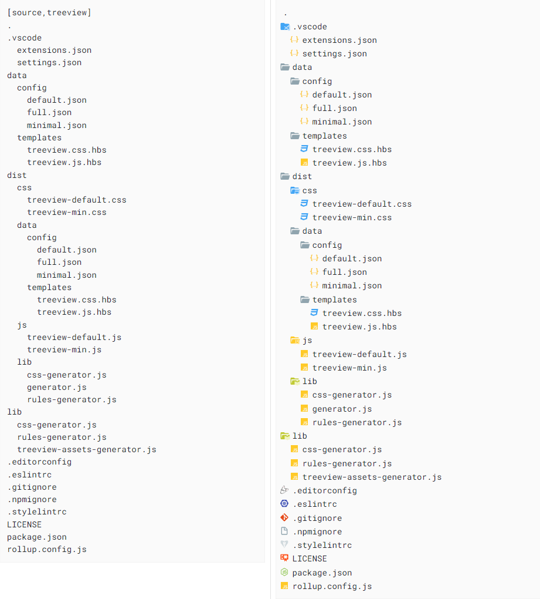
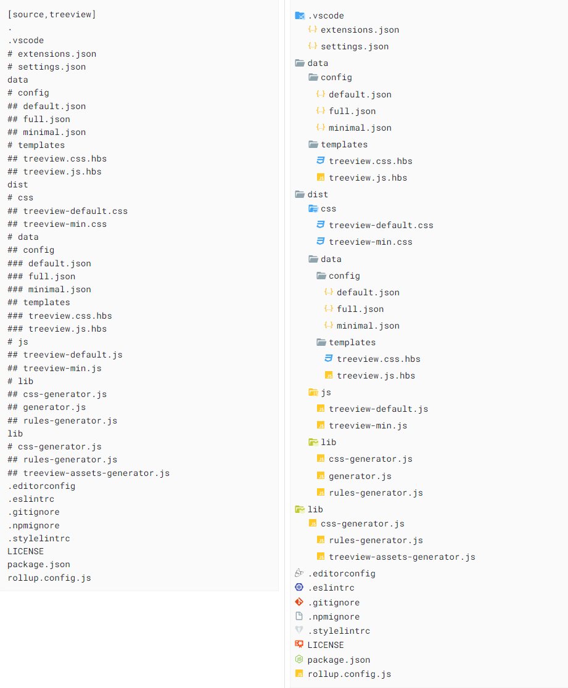

# highlights-treeview

This highlight.js extensions renders filetrees instead of code. Input formats are:

* AsciiTree
* Tabs-based indented trees
* Hash-based indented trees

This extenions uses by default the [material-icons-theme](https://www.npmjs.com/package/material-icon-theme) by PKief that is also used in VSCode.

## Features

* Displayes icons of folders, files and dotfiles by their type or name
* Provides highlight.js css and js files
  * default theme (which provides a predefined set of icon mappings)
  * minimal theme (only basic file and folder icons)
* CSS files contains all icons as base64 encoded data-urls
* Create your own theme by using a configurable generator to create your own css file and highligh.js language definition.

## Examples

### AsciiTree



### Tabs-based indented trees



### Hash-based indented trees



## Usage

### Include the predefined language javascript

```javascript
var hljs = require('highlight.js/lib/core')

hljs.registerLanguage('treeview', require('highlightjs-treeview/dist/js/treeview-default'))

// or

hljs.registerLanguage('treeview', require('highlightjs-treeview/dist/js/treeview-minimal'))

```

### Include the predefined language css

Simply include the css file into you CSS file.

```css
@import "highlightjs-treeview/dist/css/treeview-default.css";

/* or */

@import "highlightjs-treeview/dist/css/treeview-minimal.css";
```

### Generate your own theme

This package comes with a generator that can be used to create your own theme.

```javascript
const treeViewerAssetsGenerator = require('highlightjs-treeview/generator')

treeViewerAssetsGenerator.generateTreeViewAssets({
  outputCSS: `${src}/css/vendor/treeview.css`, // required
  outputJS: `${src}/js/vendor/treeview.js`, // required
  outputImagesDir: `${src}/img/treeview/`, // optional
  config: {
    configName: 'default', // required
  },
})
```

You can define

### Theming Configuration

Default Theme Configuration:

```json
{
  "options": {
    "showFolderExpanded": true,
    "inheritFileNames": false,
    "inheritFolderNames": false,
    "inheritFileExtensions": false
  },
  "defaults": {
    "file": "file",
    "folder": "folder",
    "folderExpanded": "folder-open"
  },
  "fileNames": {
    ".editorconfig": "editorconfig",
    ".eslintrc": "eslint",
    ".gitignore": "git",
    ".gitlab-ci.yml": "gitlab",
    ".nvmrc": "nodejs",
    ".stylelintrc": "stylelint",
    "bun.lockb": "bun",
    "LICENSE.md": "certificate",
    "LICENSE": "certificate",
    "package-lock.json": "nodejs",
    "package.json": "nodejs"
  },
  "fileExtensions": {
    "ad": "asciidoc",
    "adoc": "asciidoc",
    "cjs": "javascript",
    "css": "css",
    "hbs": "handlebars",
    "js": "javascript",
    "json": "json",
    "jsx": "javascript",
    "md": "markdown",
    "mjs": "javascript",
    "svg": "svg",
    "yml": "yaml"
  },
  "folderNames": {
    ".vscode": "folder-vscode-open",
    "css": "folder-css-open",
    "dist": "folder-dist-open",
    "docs": "folder-docs-open",
    "helpers": "folder-helper-open",
    "images": "folder-images-open",
    "img": "folder-images-open",
    "js": "folder-javascript-open",
    "layout": "folder-layout-open",
    "layouts": "folder-layout-open",
    "lib": "folder-lib-open",
    "partials": "folder-include-open",
    "vendor": "folder-lib-open"
  }
}
```

Minimal Configuration:

```json
{
  "options": {
    "showFolderExpanded": true,
    "inheritFileNames": false,
    "inheritFolderNames": false,
    "inheritFileExtensions": false
  },
  "defaults": {
    "file": "file",
    "folder": "folder",
    "folderExpanded": "folder-open"
  },
  "fileNames": {},
  "fileExtensions": {},
  "folderNames": {}
}
```

## How to use it in Antora

You can customize the treeview by using the generator and integrate it into your build pipeline.

### Generate your own theme with gulp

* Create your own gulp task that generates the assets
* Generate directly into your css and js folder

```javascript
'use strict'

const treeViewerAssetsGenerator = require('highlightjs-treeview/generator')

module.exports = (src) => (done) => generateTreeViewAssets(src).then(done)

async function generateTreeViewAssets (src) {
  try {
    return treeViewerAssetsGenerator.generateTreeViewAssets({
      outputCSS: `${src}/css/vendor/treeview.css`,
      outputJS: `${src}/js/vendor/treeview.js`,
      outputImagesDir: `${src}/img/treeview/`,
      config: {
        configName: 'default',
      },
    })
  } catch (error) {
    console.error('Error in generateTreeViewAssets:', error)
  }
}
```

### Register treeview language

Add this line to src/js/vendor/highlightjs.bundle.js

```javascript
// add generated treeview language
hljs.registerLanguage('treeview', require('./treeview'))

// or use predefined
hljs.registerLanguage('treeview', require('highlightjs-treeview/dist/js/treeview-default'))
/* or */
hljs.registerLanguage('treeview', require('highlightjs-treeview/dist/js/treeview-minimal'))
```

### Register treeview css

Add this line to src/css/site.css

```css
/* use generated css */
@import "vendor/treeview.css";

/* or used predefined */
@import "highlightjs-treeview/dist/css/treeview-default.css";
/* or */
@import "highlightjs-treeview/dist/css/treeview-minimal.css";
```

## Icon sources

Icons are extracted from the [material-icons-theme](https://www.npmjs.com/package/material-icon-theme).
A great source for icons for folders and files.
